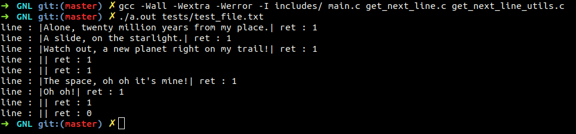
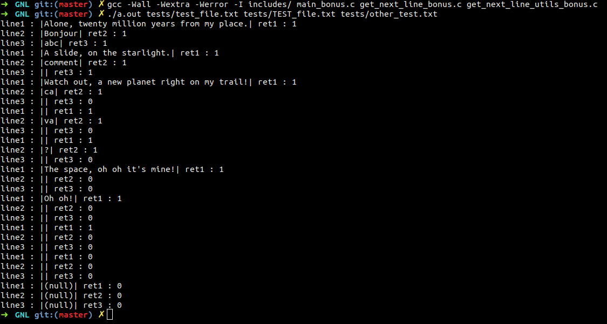

# GET_NEXT_LINE
The purpose of this project is to create a function that returns a line ending with a '\n' red from a file descriptor without previously knowing its size.
> BONUS PART : Manage multiple files

# Building

``$> git clone https://github.com/lilafallet/GNL_42.git ``

``$> cd GNL_42``
   
# Testing

Normal part :

Bonus part :

